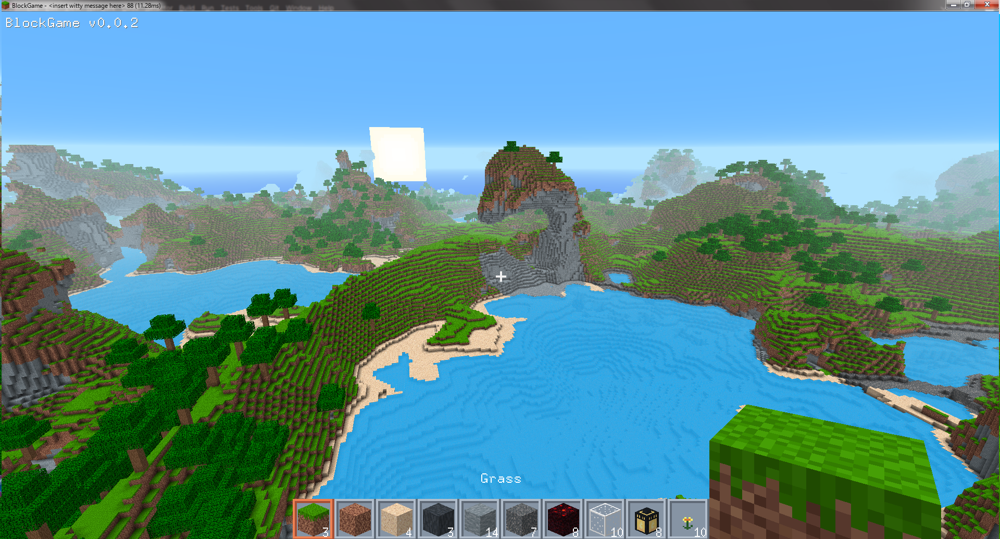
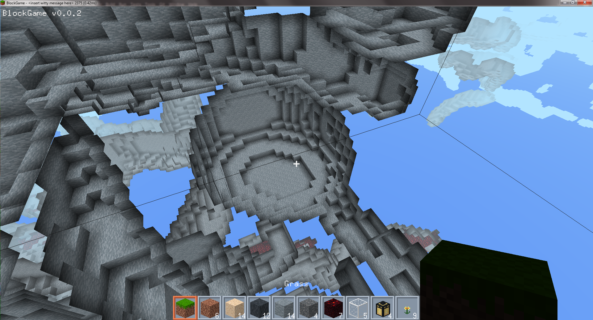
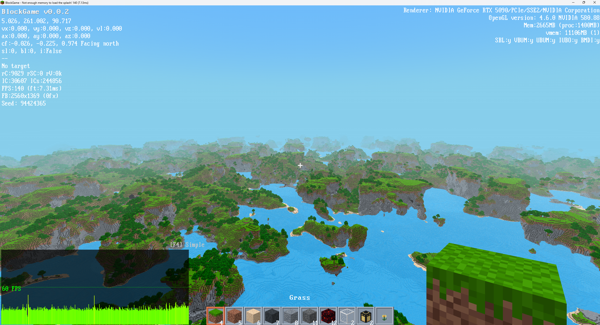

# BlockGame

A block game where you can do anything you want, with no one to stop you.

## What is this?

Build stuff, break stuff, explore the world. We're making a game focused on *emergent gameplay* - the kind where you have a bunch of toys to play with and discover instead of content checklist gameplay. There's a few other ones, but this one is mine.

## Why should I care?

Most block games fall into two camps:
- **Corporate slop:** Full of microtransactions, slop content and zero soul put into it
- **Your average open source voxel engine:** Endless refactoring and bikeshedding, not much gameplay and fun to be had

This one is a bit different:
- We're putting the sand back in the sandbox, not removing all the fun things!
- The world looks absolutely *inspiring* to build in, just like you used to build in 2011.
- New updates every week or so.
- We listen to feedback - suggestions actually matter lol
- Real modding - write C# code, not JSON
- It's a game made by people who like to play games, no nonsense.

[//]: # (## Show)

[//]: # ()
[//]: # (*[todo add the screenshots showing caves/lighting, building, mobs, UI, whatever looks cool]*)

## Follow development

Join the [Discord server](https://discord.gg/TEJD5YQfuc).

## Nerd stuff

**Tech:** Custom C# engine on .NET 10, running on extended OpenGL 4.5.

Want to be a part of the project? Read [CONTRIBUTING.MD](./CONTRIBUTING.md) first.

## Credits

- Huge thanks to `ThomasMiz` for TrippyGL and the Silk.NET contributors for their bindings
- Thank you `rds1983` for FontStashSharp!
- Thank you everyone on the server for feedback and testing
- Thank you `Notch` for making the ultimate sandbox

---

*Yeah we can do this too*