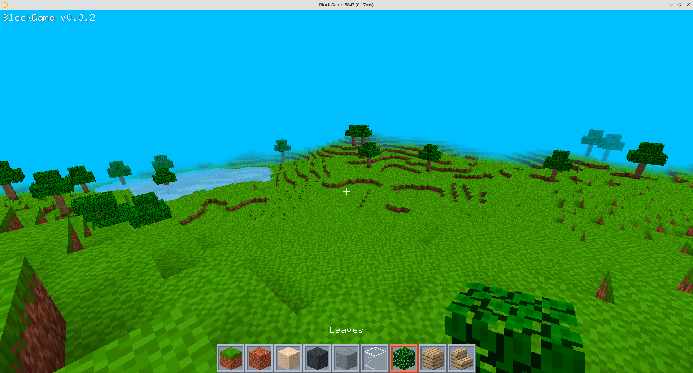

# BlockGame

* [What?](#what)
* [Why?](#why)
* [Installation](#installation)
* [Contributing](#contributing)
* [Acknowledgments](#acknowledgments)

## What?

This is a game made of blocks where you can do anything you want. It's currently under development - check back soon for updates!

## Why?

For a real software project, the [Introduction](#introduction) section – which you are presently reading – should summarize the motivations for creating the software, the need(s) addressed by the software, what the software does, and optionally, links to resources that can help orient readers. Ideally, this section should be short and use plain language. Keep in mind that not all readers will be familiar with the topic area.

The existing games in the genre can be categorised into two main categories, each with its own problems.
* ### Soullessness and bloat
These games are often made by large companies with the goal of making money. They are often filled with microtransactions and ads, and are often not very fun to play.
They are less focused on a sandbox experience where the player can do anything they imagine,
instead concentrating on adding content and RPG elements. They also have *strong* creative control - the player can't do anything that the developers didn't think of and there isn't much possibility for emergent gameplay.

In most updates, they add content, but none of that allows fun new gameplay. It just adds bloat to the game and makes the player have choice paralysis in what to build with.

They often try to prioritise `modding support` but it's almost exclusively based on data-driven modding (with JSON files or similar), which has several problems.
It is often very limiting, and it's usually just painful/hard to use without generating data files, which adds friction for modders to get started.
Many modders give up before they even start because of this. It also makes it hard to make mods that change the core gameplay, as the game is not designed to be modded in that way.
Most mods are just adding new content (more of the same) because removing/changing content means incompatibility with other mods, which is strictly shunned in these games.

This 
* ### Making an engine instead of a game
These games are usually open source. They are often made by random contributors - not a single person or a team. They are often made by people who are more interested in making an engine than a game.
They do not add much content, focusing on random technical features and refactoring instead. Even when someone shows up who is willing to create textures, menus or guides -
they get discouraged by the hostile approach to contributions. There is no clear vision for the game - decisions are made democratically by contributors,
so the game ends up being a mess of features and many feature requests/pull requests languish for years because the contributors can't decide whether to accept the contribution.

The modding ecosystem in these games is a mess. There are many mods that are incompatible with each other, and the modding API is quite limiting. The developers are not interested in including core gameplay,
so very basic mods are incompatible with each other or don't play nice with other mods.

## Installation

Right now, the game is not in a phase yet where there are public releases. It is possible to build the game from source if you know how - instructions are not provided here though.

## Contact

Add me on Discord (pannoniae) or join the project's [server](https://discord.gg/yes).

## Contributing

See [CONTRIBUTING.MD](CONTRIBUTING.MD).

## Acknowledgments

- Huge thanks for ThomasMiz for TrippyGL and the Silk.NET contributors for their bindings.
- Thank you `rds1983` for FontStashSharp!
- Thank you 1980's anons for making the X11 fixed spritefonts which the project uses. 
- Thank you everyone on `my server` for feedback and testing.
- Thank you `notch` for being a champ and making the ultimate sandbox!